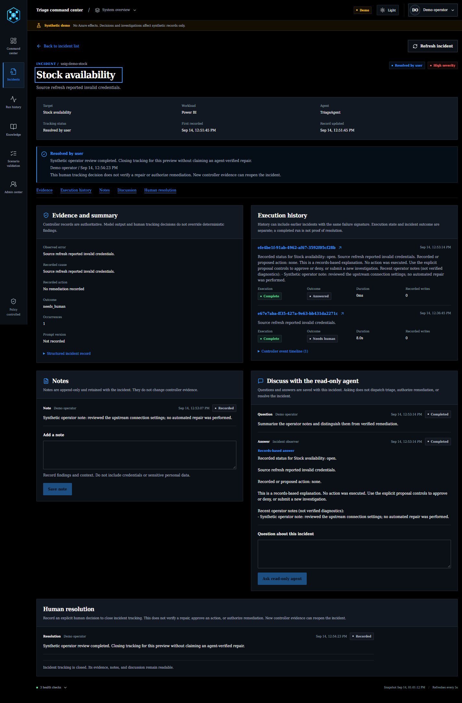
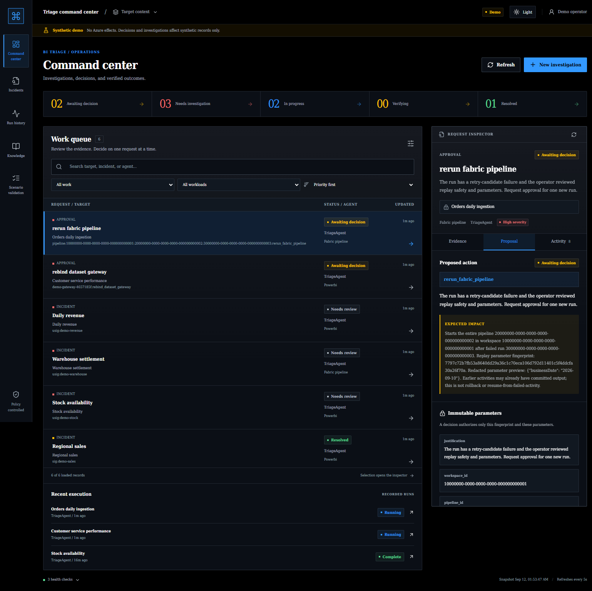
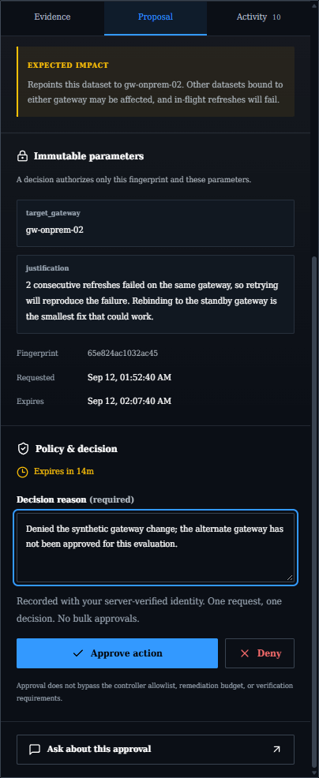
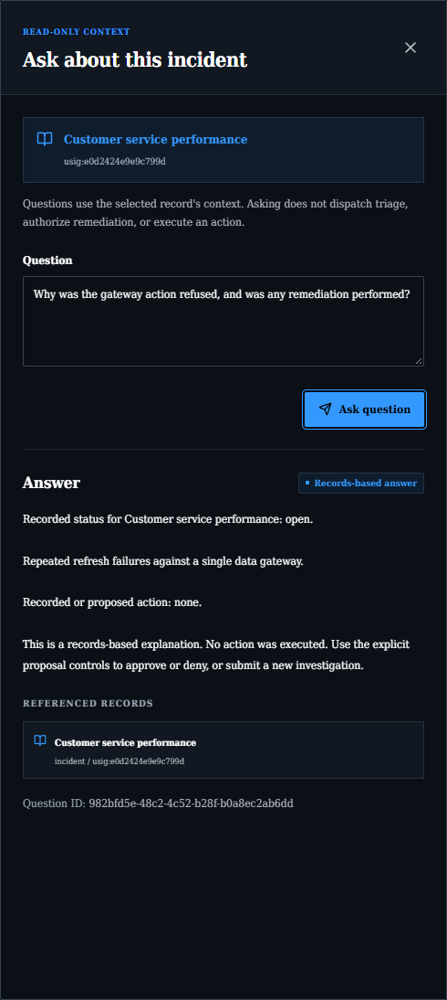

# Agent command center

`command-center/` is a React application served by a FastAPI API on Azure App
Service. It reads the controller's Fabric SQL state and adds authenticated
approvals, a durable investigation queue, full run history, incident notes and
read-only questions. Teams is optional. The existing read-only Fabric App in
`cockpit/` can remain deployed; neither app owns the state database.

The interface uses self-hosted DejaVu Serif Condensed, Onyx colors, 2px corners
and 7px offset shadows. Font licensing is included with the frontend assets.
The supplied triage artwork appears in the sidebar, sign-in view and favicon.

## Operator workflows

| Page or control | Behavior |
|---|---|
| Command center | Pending approvals and work needing investigation, with a persistent detail inspector |
| Incidents | Searchable incident register and a full-page record with evidence, notes, discussion and user resolution |
| Run history | Individual controller runs, recorded tool steps, outcomes and policy counters |
| Approve / deny | Authenticated, fingerprint-bound, unexpired, single-use decisions |
| New investigation | Enqueues a command for an explicitly configured Power BI or pipeline target |
| Ask | Explains recorded evidence through a separate observer; cannot call remediation tools |
| Knowledge | Public-source troubleshooting playbooks |
| Scenario validation | Administrator-only execution of the canonical scenarios with synthetic tools and isolated state |
| System overview | Signed-in user, monitored resources, agent team and service health |
| User menu | Profile photo, or initials when unavailable, and Sign out |
| Access & permissions | Reader-visible, read-only effective application roles, token freshness and Entra management guidance |

The queue and recent-history projections are bounded. They are operational
windows, not a replacement for an unrestricted SQL report. Earlier incident
aggregates cannot reconstruct tool steps that were never persisted.

### Queue filters

**Needs investigation** includes incidents with the API status `needs_review`.
The queue and inspector use the same display label as the filter without
changing the stored status. Attention-summary tiles select a status group in
the command-center queue and clear search and workload filters, because their
counts are not scoped to those filters. Selecting an already active,
unconstrained tile returns to **All work**.

The workload filter always offers **Power BI** and **Fabric pipeline**, even
when the snapshot has no records for one of them. A workload with no matching
records shows an empty state; its presence does not configure or start
monitoring. Notebook activity failures appear under their parent pipeline.
Standalone notebook-job monitoring is not implemented.

### Incident records

The command center retains its queue and inspector. **See full incident details**
opens the linked record in **Incidents**, which has its own paged register and
full-page workspace rather than a second copy of the queue.

Users with Operator or Admin permission can append notes and record a resolution
with a reason. **Resolved by user** is distinct from an agent-verified repair.
The tracking record does not replace the controller's evidence, reset its
remediation budget, release a claim or approve a pending action. A closure is
bound to the evidence reviewed; a newer occurrence cannot remain hidden behind
that older closure.

Choose **Review human resolution**, review the reason and evidence, then confirm
that only human tracking is being closed. The API conditionally appends the
decision against both the tracking version and the original stored incident
payload's source revision. A `409` means the evidence or tracking changed:
refresh and review again. Notes and questions do not advance the tracking
version. No mutation is automatically retried after an uncertain response.

Notes, resolution history and read-only agent discussion persist in Fabric SQL.
An unanswered or failed question remains visible rather than appearing as a
successful reply. The observer has no remediation tools. Questions and answers
remain separate from action proposals and their explicit approval controls.
Closed incidents remain searchable, and their evidence and discussion remain
readable.

Execution history labels each run by its agent, with the run ID and outcome
metadata kept separate from the explanation. The newest explanation opens by
default; older explanations can be expanded without losing that choice on
refresh. The shared Markdown renderer uses 15px prose for execution explanations,
run details and observer answers, including headings, lists, emphasis and code.
Raw HTML, embedded images and non-HTTPS links are not rendered. A completed run
does not by itself establish that its incident was repaired.



## Safety boundaries

The browser has no SQL credential and cannot choose an arbitrary tool or target.
The API derives the actor from a validated Entra access token, checks application
roles and writes only controlled state transitions. The hosted controller
drains commands and retains its existing allowlists, policy ledger and evidence
validation.

Web approval proposals cannot be answered through the legacy bearer-link
callback. Opening a Teams deep link only selects a proposal; it never approves
one. Optional Teams delivery runs independently of the web approval window, so
a slow or failed Teams post does not disable web decisions.

An investigation is not the same as an authorization to remediate. Pipeline
reruns still require reviewed replay safety and explicit approval. A denial
does not spend the remediation budget.

## Local preview

```powershell
.\.venv\Scripts\python.exe -m pip install -e ".[dev,web]"
npm --prefix .\command-center ci
npm --prefix .\command-center run build
.\.venv\Scripts\bi-triage.exe serve --mode demo --host 127.0.0.1 --port 8058
```

Open `http://127.0.0.1:8058`. Demo mode uses synthetic state and mock tools even
when a local `.env` contains live settings. It rejects non-loopback clients and
refuses to start inside an Azure-hosted web app.

The pending demo approvals belong to running mock-controller flows. Approving
or denying them changes those flows, rather than editing detached example
rows. Restarting the local demo creates fresh isolated fixtures.



This image is a local synthetic preview, not evidence of a production action.

The following local examples show a real mock-controller approval gate and a
records-based question. The web controls, not a Teams callback, supplied the
decision. All tools and data in these images are synthetic.

| Approval review | Read-only question |
|---|---|
|  |  |

## Authentication and roles

The SPA uses authorization code with PKCE through MSAL. The API validates an
RS256 Entra JWT against a fixed tenant, issuer, application audience, expiry,
issued/not-before times, object ID, delegated `access_as_user` scope and
application roles. It does not trust a browser-supplied responder or an
`X-MS-CLIENT-PRINCIPAL` header.

| App role | Permissions |
|---|---|
| `CommandCenter.Reader` | View state and ask read-only questions |
| `CommandCenter.Operator` | Reader access, enqueue configured investigations, add incident notes and record user resolutions |
| `CommandCenter.Approver` | Reader access and approve or deny eligible proposals |
| `CommandCenter.Admin` | All application permissions, scenario validation and explicit uncertainty reconciliation |

Operator and Approver are separate: neither includes the other. Admin includes
both but grants no Entra directory administration.

The web app uses a user-assigned managed identity for SQL and Foundry. These
service permissions are separate from the human application roles.

The profile menu obtains the signed-in user's photo with a separate Microsoft
Graph **delegated `User.Read`** token. The command-center API token is never sent
to Graph. No directory-wide read/write permission is required. A missing photo
uses initials; unavailable consent or a failed photo request does not sign the
user out or silently grant a permission.

### Entra-managed groups

Entra app-role claims are the sole application permission authority. The API
validates them on every request; SQL incident state cannot grant access.
**Access & permissions** is read-only and shows the signed-in user's effective
roles, not a locally maintained roster or unverified group-membership claim.
It is available to Reader and all higher application roles. The page reports
**Token issued** and **Token expires** from verified API-token claims, alongside
when those details were received. Times use the browser's local time zone.
Missing claim metadata is not inferred from configuration or the current clock.

The application does not perform a runtime Graph lookup of group membership,
identify which group supplied a role, or offer Add, Edit, invite or local-grant
operations. The web identity has no directory-management permission.

Use ordinary Entra security groups assigned to the existing app roles:

| Default group name | Assigned app role |
|---|---|
| BI Triage Readers | `CommandCenter.Reader` |
| BI Triage Operators | `CommandCenter.Operator` |
| BI Triage Approvers | `CommandCenter.Approver` |
| BI Triage Administrators | `CommandCenter.Admin` |

Group owners or authorized IT administrators add existing users by name or
sign-in address in Microsoft Entra. Group-based application assignment requires
Entra P1/P2 and does not include nested group membership.
[Microsoft Learn: application assignments](https://learn.microsoft.com/entra/identity/enterprise-apps/assign-user-or-group-access-portal).
Application permissions do not grant direct Azure, Fabric or SQL access.

After registering the application, an authorized operator can prepare the group
configuration below. It is an offline plan unless `--apply` is added:

```powershell
.\.venv\Scripts\python.exe scripts\configure_command_center_groups.py `
  --subscription "<subscription>" --tenant-id "<tenant-guid>" `
  --app-id "<application-client-id>" --admin-current-user
```

With `--apply`, the helper creates owned ordinary security groups, assigns the
current operator as their owner and as a member of the administrator group, and
binds the app roles. It refuses unmarked name collisions and does not delete
existing assignments, including direct user assignments.
Creating groups and app-role assignments requires appropriate permissions on
the operator's directory identity; none are granted to the web application.
Manage subsequent membership in Entra, not through this helper.

**Refresh permissions** requests a fresh API token for the current session.
It then reloads effective access and the command-center snapshot. Actions stay
locked until a snapshot loaded after that renewal confirms current permissions;
an older successful snapshot cannot unlock them. Renewal failure remains an
explicit error, and sign-in or consent is never opened automatically by refresh.
Entra changes can take time to propagate, and already-issued tokens may retain
old roles until they expire or are replaced. Refreshing one session does not
revoke another user's token. Deployments needing a shorter revocation window
require a separately designed current-state authorization check; this app does
not silently substitute a stale local permission cache.

Earlier versions used a SQL membership table and an in-app permission editor.
The SQL authorization store, service, table schema and importer are retired;
there is no database authorization fallback. Authenticated calls to the old
`GET`/`POST /api/admin/users` and `GET /api/admin/audit` routes return `410` with
`managed_in_entra`. Old `?view=admin` links open the read-only **Access &
permissions** page instead.

Do not enable `COMMAND_CENTER_ACCESS_MANAGEMENT_ENABLED`; the app rejects that
retired mode. The deployment helper also refuses to overwrite a deployment
where it is still enabled. Verify the existing Entra assignments and a fresh
administrator session before removing or disabling that setting and deploying
the Entra-only version. This is an authorization cutover, not an operational
reset: retain the application registration, cloud resources, incidents, notes,
approvals and run history. Any cleanup of an old authorization table is separate
from, and must not clear, operational state.

## Deployment

Complete the existing [deployment prerequisites](./DeploymentGuide.md) first.
Keep the standalone Fabric SQL database and Foundry project. The command-center
template does not create, replace or delete them.

### 1. Register the SPA/API

```powershell
.\.venv\Scripts\python.exe scripts\register_command_center.py `
  --subscription "<subscription>" `
  --tenant-id "<tenant-guid>" `
  --display-name "BI Triage Command Center" `
  --webapp-origin "https://<app-name>.azurewebsites.net" `
  --admin-current-user
```

The script creates no secret or certificate. Save the returned application
client ID. Reruns can specify `--application-id` to reuse that registration.
`--authorize-azure-cli --grant-admin-consent` is an explicit evaluation option:
it grants delegated consent for the selected administrator, not the entire
tenant. It is not required for normal browser use.

The registration requests delegated Graph `User.Read` for the profile menu.
`--grant-profile-consent` separately grants that scope only for the selected
administrator and this SPA. It creates no Graph application permission or
tenant-wide grant. Other users follow the tenant's normal consent process.

### 2. Provision the private web host

Create an operator-owned JSON settings file outside the repository. Values must
be strings. Required keys are `FABRIC_SQL_SERVER` (hostname without `,1433`),
`FABRIC_SQL_DATABASE` and `FOUNDRY_PROJECT_ENDPOINT`. Common optional keys are
`FOUNDRY_TRIAGE_AGENT_NAME`, `FOUNDRY_DQ_AGENT_NAME`,
`FOUNDRY_OBSERVER_AGENT_NAME`, `COMMAND_CENTER_QUESTION_PROVIDER`,
`POWERBI_WORKSPACE_ID`, `POWERBI_DATASET_ID`, `FABRIC_PIPELINE_TARGETS` and
`PIPELINE_SWEEP_ENABLED`. No connection secret, webhook or filled-in `.env` is
accepted by the deployment script.

```powershell
.\scripts\deploy_command_center.ps1 `
  -Subscription "<subscription>" -ResourceGroup "<resource-group>" `
  -Location "<region>" -AppName "<app-name>" -PlanSku P0v3 `
  -TenantId "<tenant-guid>" -ApplicationClientId "<application-client-id>" `
  -CostCenter "<cost-center>" -Owner "<owner>" `
  -Environment "Evaluation" -DataClassification "Synthetic" `
  -ApplicationSettingsFile "<absolute-path-to-settings.json>" `
  -ValidateOnly
```

Review the what-if result, then use the same parameters with
`-Deploy -ProvisionOnly`. This creates a Linux App Service plan/app, user-assigned
identity, VNet integration, a private endpoint/DNS link and NAT egress. Select a
region/SKU that passes actual ARM validation: advertised quota alone does not
prove worker admission.

The template disables public ingress and basic SCM/FTP publishing credentials.
The NAT public IP is outbound-only. New subnets have explicit egress and
`defaultOutboundAccess=false`. The site-level
`outboundVnetRouting.allTraffic=true` property sends application and
configuration traffic through that VNet. Read it back after deployment rather
than assuming the presence of a NAT gateway proves that traffic uses it.
The deployment helper also preserves existing subnet NSG bindings, including
those attached after provisioning by governance. Direct Bicep deployments must
provide the corresponding `integrationSubnetNsgId` and
`privateEndpointSubnetNsgId` values rather than detaching those controls.

### 3. Install the schema and grant service access

Run the additive schema installation as a database administrator before starting
the web app. Existing tables and incident rows are retained. The schema includes
`triage_agent_runs`, `triage_agent_events`, `triage_agent_commands` and
`triage_incident_activity`, plus the pipeline rerun journal. The updated legacy
approval procedure rejects web-owned proposals.

```powershell
.\.venv\Scripts\python.exe -c "from triage.settings import settings; from triage.store.fabric_sql import FabricSqlDatabase; db=FabricSqlDatabase(server=settings.fabric_sql_server,database=settings.fabric_sql_database); assert db.ensure_schema_once(), 'Schema installation failed'"
```

Create an external SQL user for the web identity and grant only:

| Object | Web identity permissions |
|---|---|
| Database | `CONNECT` |
| `triage_incidents`, `triage_pipeline_reruns` | `SELECT` |
| `triage_approvals` | `SELECT`, `UPDATE` |
| `triage_agent_runs`, `triage_agent_commands` | `SELECT`, `INSERT`, `UPDATE` |
| `triage_agent_events` | `SELECT`, `INSERT` |
| `triage_incident_activity` | `SELECT`, `INSERT` |

The web identity needs no `db_ddladmin`, `DELETE` or callback-procedure execution
permission. Adjust object names if using configured table prefixes.
Incident collaboration also uses append-only inserts and needs no write grant
on `triage_incidents`. Set `INCIDENT_ACTIVITY_TABLE_NAME` when using a distinct
deployment prefix. Its source-revision check hashes the original SQL NVARCHAR
payload with SHA-256 over UTF-16 LE bytes, matching SQL `HASHBYTES`.
Reserialization or new controller evidence therefore invalidates an older user
closure; hashing a reserialized Pydantic model would not reliably match the
stored payload.

For **Fabric SQL**, `CREATE USER ... WITH SID ..., TYPE = E` encodes a service
principal or managed identity's **client ID**, not its principal object ID.
Azure RBAC and Fabric role assignments use the **principal object ID** instead.
See the public [CREATE USER documentation](https://learn.microsoft.com/sql/t-sql/statements/create-user-transact-sql#arguments).
Do not treat these two IDs as interchangeable.

Grant the identity only the Foundry access needed to invoke the configured
agents. The current provider posts to the **project Responses API** with an
`agent_reference`; this is not the same authorization boundary as a published
agent endpoint. In live verification, endpoint-consumer and restricted custom
roles could read agent metadata but could not perform inference.
[Foundry User](https://learn.microsoft.com/azure/foundry/concepts/rbac-foundry)
(`53ca6127-db72-4b80-b1b0-d745d6d5456d`) at the dedicated Foundry account scope
was verified for this provider.

That role includes agent-development permissions, not just invocation. Keep the
account dedicated to this accelerator and do not present it as an
invocation-only grant. The reasoning agents still receive no Power BI or Fabric
permissions. Endpoint-only callers such as the scheduler use the narrower
Foundry Agent Consumer role. Prove the actual operation under each managed
identity; a role assignment's existence is not an access test.

Fabric item authorization and private routing/DNS are separate prerequisites.
Do not assume a new web VNet can reach existing private services merely because
its own private endpoint deployed successfully.

### 4. Configure and deploy the controller

The controller and web app must point at the same state tables and target
configuration. Set these in the selected azd environment:

```powershell
azd env set RUN_HISTORY_ENABLED true
azd env set APPROVAL_DELIVERY_MODE web
azd env set NOTIFICATION_CHANNEL web
azd env set COMMAND_CENTER_URL "https://<app-name>.azurewebsites.net"
.\.venv\Scripts\python.exe scripts\register_foundry_agents.py
azd deploy bi-triage-controller --no-prompt
```

Registration updates the triage definition and adds the tool-free observer.
Local prompt edits alone do not change a registered Foundry agent.

### 5. Package and deploy the web app

Run the deployment script again with `-Deploy`, without `-ProvisionOnly`.
It typechecks/builds the frontend, includes the canonical scenarios and mock
assets, scans the staged package for credentials, and uploads a ZIP through
Entra-authenticated deployment. Python dependencies are installed by Oryx.
The helper waits for ZIP/Oryx completion, then checks `/api/health` directly.
It disables the CLI's separate startup-status tracker, which can keep waiting
after Kudu and the actual web process are ready. This liveness check does not
replace authenticated SQL and Foundry checks.

The deployment host must reach both the private app and SCM hostnames. An
explicit, authorized temporary verification window can use
`-TemporaryPublicAccess -PublicAccessClientCidr "<client-ip>/32"`. Only
single-host CIDRs are accepted; access otherwise defaults to deny. The script
restores `publicNetworkAccess=Disabled` in `finally`. Permanent access needs a
private route and DNS, not a forgotten temporary exception.

With a proxy, the address reported by a generic IP-echo service can differ from
the address App Service sees. Inspect `x-ms-forbidden-ip` on a controlled SCM
request that returns 403, then supply the explicitly approved proxy egress
addresses as separate `/32` entries. Do not widen the rule to an entire network.
Global Secure Access can produce this difference. Its egress addresses can
change or be shared, so an IP allowlist does not uniquely identify a device.
Keep Entra authorization enforced and refresh only verified client addresses;
do not disable Global Secure Access to make the application reachable.

### 6. Schedule command draining

Deploy another instance of `infra/scheduled-sweep.json` with
`command="command sweep"`, and grant its managed identity permission to invoke
the hosted controller. Use the same workflow as
[scheduled sweeps](./DeploymentGuide.md#6c-scheduled-sweeps), with a distinct
Logic App name. A manual equivalent is:

```powershell
azd ai agent invoke bi-triage-controller "command sweep"
```

The scheduler's 15-minute timeout exceeds the default combined command-worker
deadline of 630 seconds: 300 seconds of triage, 300 seconds awaiting approval
and 30 seconds of overhead. If changing these budgets, keep the caller timeout
longer. A missing response is not evidence that no work executed.
The scheduler also validates the Responses body: HTTP 200 is insufficient when
`status` is failed or an error is present. Those runs remain failed even without
a Teams failure webhook.
Logic Apps' binary `$content` wrapper is decoded first when present, including
responses carrying `Content-Encoding: identity`.

The web process does not execute production commands. Without this worker,
requests remain queued. Configure actual targets explicitly; an empty target
list must not select an arbitrary model or pipeline.

## Interrupted commands and reconciliation

Commands are claimed conditionally in SQL. Separate command IDs for the same
normalized target also share a target claim. An expired execution becomes
`interrupted`, not queued again. A timeout after entering execution, an
unconfirmed remediation or an uncertain finalization blocks further command
execution for that target.

Candidate queries exclude blocked targets before applying their limit, so a
large blocked backlog cannot hide unrelated eligible work. The worker checks
its remaining execution budget again after command acquisition; acquiring a
command cannot extend the deadline or authorize a late dispatch.

An administrator must inspect the target's actual state, then record a
reconciliation reason. Reconciliation marks the interrupted command as terminal
failed, preserves its idempotency identity and audit fields, and performs no
remediation. Submit a new investigation only after that review.

These target barriers protect the command-worker entry point. They do not
retroactively serialize every older interactive/mailbox path; see the
[claims limitations](./TechnicalArchitecture.md#which-paths-are-claimed-and-one-that-is-not).

## Validation and evidence

Enable `-Evaluation -EvaluationExpiresOn "<YYYY-MM-DD>"` only for a controlled
evaluation. `-EvaluationCostExemption` additionally opts into a finite
cost-control exemption; the review-date tag is not an automatic shutdown.
Governance can stop or resize resources after an exemption ends.

The administrator Scenario validation page runs the 15 canonical cases
advertised by the API with at most two concurrent requests. Each run records
expectations, outcome and a durable run ID. Mock-provider validation checks
deployed controller behavior. Foundry-provider validation also exercises
registered agents and real model calls. **Both use synthetic tools and isolated
scenario state**, not production remediation, and neither resets shared
incident tables. Demo mode offers only the mock provider.

**Stop queue** prevents new requests; it cannot cancel work already accepted by
the server. Assertion failures do not stop the remaining cases, but transport
uncertainty or lost authorization stops further scheduling. Requests are not
automatically retried. Review recorded results before submitting a case again.

Use separate live checks for identity access, SQL arbitration, scheduling and
real Fabric job/activity correlation. `/api/health` proves only process
liveness. SQL errors and failed model calls must remain explicit errors, never
invented healthy state or a silent mock fallback.

Foundry validation consumes the model deployment's rate limits. If a batch
reports 429, pace cases rather than increasing controller policy budgets.
Review the recorded exception and rerun the affected cases after the quota
window resets. SQL-unavailable errors retain a redacted connection cause so an
operator can distinguish a login/import failure from a connection timeout even
when a hosted session's earlier console output is no longer available.
The reconnect cooldown starts only after an actual connection failure. Its
never-failed sentinel is `None`: using zero incorrectly blocked first
connections during a fresh hosted sandbox's first 30 seconds of monotonic
uptime, without attempting SQL or producing a connection exception.

Disable evaluation and remove temporary access/exemptions when finished.
Full prompts, completions and reasoning are not written to run events or
telemetry; recorded evidence is redacted at the store boundary. Explicit
read-only questions and observer answers are retained as redacted discussion
and run records, not as telemetry.

## Deployment validation record

The 2026-09-12 evaluation ran all 15 canonical cases on the deployed web
application with both provider modes. Each terminal result and its events were
read back from Fabric SQL. **Pass means the scenario's expectations matched,
not that every incident was resolved.** Denial, suppression, escalation and
pending verification are expected outcomes in their respective cases.

Both modes used synthetic tools and isolated scenario state. Foundry mode also
used the registered agents and real model calls. These results do not claim
that a production dataset or pipeline was remediated.

| Scenario | Verified outcome | Mock | Foundry |
|---|---|---|---|
| `scenario1-transient` | `resolved` | Pass | Pass |
| `scenario2-data-quality` | `flagged_data_quality` | Pass | Pass |
| `scenario2b-known-issue` | `duplicate_suppressed` | Pass | Pass |
| `scenario3-policy-block` | `needs_human` | Pass | Pass |
| `scenario4-unknown-action` | `needs_human` | Pass | Pass |
| `scenario5-approval-granted` | `resolved` | Pass | Pass |
| `scenario6-approval-denied` | `approval_denied` | Pass | Pass |
| `scenario7-schedule-reenable` | `resolved` | Pass | Pass |
| `scenario8-capacity-backoff` | `deferred_retry` | Pass | Pass |
| `scenario9-pipeline-authentication` | `needs_human` | Pass | Pass |
| `scenario10-pipeline-rerun-approved` | `resolved` | Pass | Pass |
| `scenario11-pipeline-rerun-denied` | `approval_denied` | Pass | Pass |
| `scenario12-pipeline-schema-mismatch` | `needs_human` | Pass | Pass |
| `scenario13-pipeline-rerun-pending` | `needs_human` | Pass | Pass |
| `scenario14-pipeline-write-timeout` | `needs_human` | Pass | Pass |

The model deployment allowed 50,000 tokens and 50 requests per minute.
Concurrent validation hit 429 limits; the affected cases passed when run one
at a time with 75 seconds between cases. The validation client refreshed its
delegated token before each authenticated request. Controller policy budgets
were not increased, and failed attempts remain in history.

Separate integration checks confirmed Entra browser sign-in, the web managed
identity's SQL reads and writes, conditional approval/command arbitration,
read-only Foundry answers, and a fresh hosted-controller SQL connection.
The command scheduler completed with a decoded `status=completed`, null error
and its narrow project-scoped consumer role. No production monitoring targets
were selected implicitly; an unconfigured deployment shows an empty target
list and disables new investigations.

### Screenshot evidence

Personal identity labels are hidden. The complete case list and tool timeline
were expanded only for capture; their recorded data was not changed.

| Evidence | Screenshot |
|---|---|
| Deployed command center and explicit unconfigured-target state | [Command center](./images/command-center/deployed-command-center.png) |
| All 15 cases in the final deployed deterministic UI batch | [Complete scenario list](./images/command-center/deployed-all-scenarios.png) |
| Foundry-backed approved pipeline rerun | [Approved and verified](./images/command-center/deployed-foundry-pipeline-approved.png) |
| Foundry-backed rerun that must remain unresolved | [Pending verification](./images/command-center/deployed-foundry-pipeline-pending.png) |
| Controller refusal of a second remediation | [Policy refusal](./images/command-center/deployed-foundry-policy-refusal.png) |
| Durable counters, outcome and full tool timeline | [Run timeline](./images/command-center/deployed-run-timeline.png) |
| Tool-free observer using recorded incident evidence | [Read-only question](./images/command-center/deployed-read-only-question.png) |
| Database-item Read without additional data-sharing grants | [Managed identity item access](./images/command-center/managed-identity-item-read.png) |

### Review corrections

| Finding | Correction |
|---|---|
| New work hidden behind terminal history or blocked-target backlog | Filter eligible states and target barriers before applying limits |
| Command acquisition could exhaust its execution deadline | Check the deadline again after command claim, before dispatch |
| Lost acknowledgement could allow another target command | Persist interruption and require audited reconciliation; never auto-requeue |
| Optional Teams delivery could spend the web approval window | Notify concurrently without blocking decision polling |
| SQL work inside async web handlers could block approvals | Offload database work, including validation history, to worker threads |
| Fresh sandbox uptime entered a cooldown that never started | Use a nullable last-failure timestamp and test clock-zero boundaries |
| HTTP 200 or CLI exit 0 concealed a failed agent response | Validate terminal response status and error; decode Logic Apps binary envelopes |
| App Service ignored legacy routing configuration | Set site-level all-traffic VNet routing and verify actual ARM state |
| Redeployment could detach a governance-added NSG | Preserve existing subnet NSG bindings |
